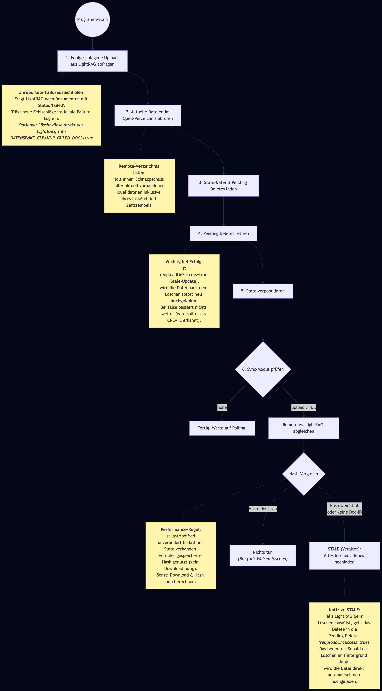
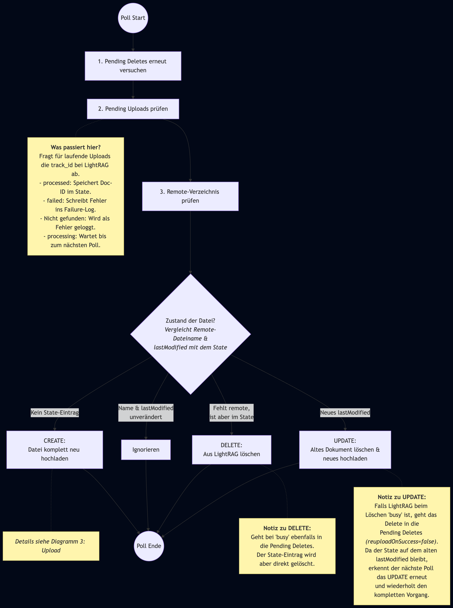
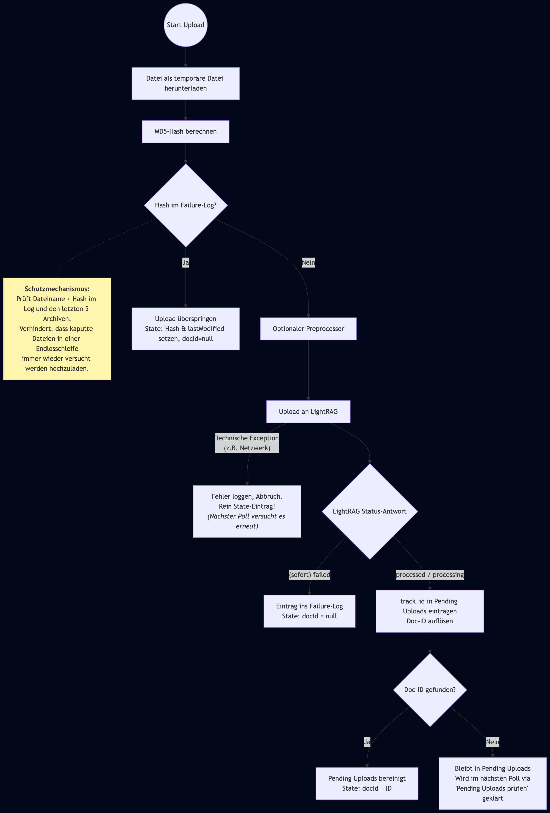

# Datensenke MVP

Proof of Concept: Eine Spring-Boot-Anwendung, die ein Verzeichnis per SFTP, FTP oder lokal auf Dateien ueberwacht und Aenderungen (Create, Update, Delete) automatisch per REST-API an [LightRAG](https://github.com/HKUDS/LightRAG) weitergibt. Die erlaubten Dateiendungen (z.B. `.pdf`, `.docx`, `.txt`) sind konfigurierbar.

## Architektur

```
┌─────────────────┐   SFTP/FTP/Local  ┌──────────────┐
│  Datei-Quelle   │ ◄──────────────► │  Datensenke  │
│ (PDF/DOCX/...)  │                  │  (Spring Boot)│
└─────────────────┘                  └──────┬───────┘
                                            │ (optional)
                                            ▼
                                     ┌──────────────┐
                                     │ Preprocessor │
                                     │ (z.B. Python)│
                                     └──────┬───────┘
                                            │ REST
                                            ▼
                                     ┌──────────────┐
                                     │   LightRAG   │
                                     │   API Server  │
                                     └──────────────┘
```

- **Polling** im konfigurierbaren Intervall (Default: 60s)
- **Protokoll** waehlbar: SFTP (SSH-Key oder Passwort), FTP oder Local (lokaler Ordner)
- **Neue Datei** auf Remote-Server → Download + Upload an LightRAG
- **Geaenderte Datei** (lastModified) → Delete + Re-Upload
- **Geloeschte Datei** → Delete in LightRAG
- **Failure Detection** → Fehlgeschlagene Uploads werden erkannt und in ein persistentes Log geschrieben

## Voraussetzungen

- Docker & Docker Compose
- Externes Docker-Netzwerk `aibox_network` (wird von LightRAG mitgenutzt)
- Laufende LightRAG-Instanz im selben Netzwerk
- Erreichbarer SFTP- oder FTP-Server mit Dokumenten (oder ein lokaler Ordner)

## Schnellstart

### 1. Docker-Netzwerk erstellen (einmalig)

```bash
docker network create aibox_network
```

### 2. LightRAG starten

```bash
docker compose -f LightRAG/docker-compose-lightrag.yml up -d
```

LightRAG WebUI ist erreichbar unter: http://localhost:9622

### 3. Konfiguration anlegen

```bash
cp .env.example .env
# .env editieren: API Key, Remote-Server-Zugangsdaten anpassen
```

### 4. Datensenke starten

```bash
docker compose up --build -d
```

### 5. Dateien auf Remote-Server ablegen

Die Datensenke verbindet sich per SFTP/FTP zum konfigurierten Server (oder ueberwacht einen lokalen Ordner), erkennt neue Dateien der konfigurierten Typen beim naechsten Polling-Durchlauf und laedt sie an LightRAG hoch.

## Konfiguration

Alle Einstellungen werden ueber eine `.env`-Datei gesteuert (siehe `.env.example`):

| Variable | Default | Beschreibung |
|---|---|---|
| `DATENSENKE_LIGHTRAG_URL` | `http://lightrag:9621` | URL der LightRAG-API |
| `DATENSENKE_LIGHTRAG_API_KEY` | _(leer)_ | API Key fuer LightRAG-Authentifizierung |
| `DATENSENKE_POLL_INTERVAL_MS` | `60000` | Polling-Intervall in Millisekunden |
| `DATENSENKE_REMOTE_PROTOCOL` | `sftp` | Protokoll: `sftp`, `ftp` oder `local` |
| `DATENSENKE_REMOTE_HOST` | _(leer)_ | Hostname/IP des Remote-Servers |
| `DATENSENKE_REMOTE_PORT` | `22` | Port (22 fuer SFTP, 21 fuer FTP) |
| `DATENSENKE_REMOTE_USERNAME` | _(leer)_ | Benutzername |
| `DATENSENKE_REMOTE_PASSWORD` | _(leer)_ | Passwort |
| `DATENSENKE_REMOTE_PRIVATE_KEY` | _(leer)_ | Pfad zum SSH Private Key (SFTP, alternativ zu Passwort) |
| `DATENSENKE_REMOTE_DIRECTORY` | `/documents` | Verzeichnis auf dem Remote-Server (bei `local`: lokaler Pfad) |
| `DATENSENKE_STARTUP_SYNC` | `none` | Startup-Sync-Modus: `none`, `upload` oder `full` |
| `DATENSENKE_STATE_FILE_PATH` | `data/datensenke-state.json` | Pfad zur persistierten State-Datei |
| `DATENSENKE_FAILURE_LOG_PATH` | `logs/datensenke-failures.log` | Pfad zum Failure-Log |
| `DATENSENKE_FAILURE_LOG_MAX_SIZE_KB` | `1024` | Max. Groesse des Failure-Logs in KB bevor rotiert wird |
| `DATENSENKE_CLEANUP_FAILED_DOCS` | `false` | Fehlgeschlagene Dokumente nach dem Loggen aus LightRAG loeschen |
| `DATENSENKE_PREPROCESSOR_ENABLED` | `false` | Externen Preprocessor vor dem Upload aktivieren |
| `DATENSENKE_PREPROCESSOR_COMMAND` | _(leer)_ | Befehl des Preprocessors, z.B. `python3 /opt/preprocess.py` |
| `DATENSENKE_PREPROCESSOR_TIMEOUT_SECONDS` | `120` | Max. Laufzeit des Preprocessors pro Datei in Sekunden |
| `DATENSENKE_ALLOWED_EXTENSIONS` | `.pdf,.doc,.docx` | Komma-getrennte Liste erlaubter Dateiendungen |

## Preprocessor (optional)

Zwischen dem Download einer Datei und dem Upload an LightRAG kann ein externer Preprocessor zwischengeschaltet werden — z.B. ein Python-Skript, das PDFs bereinigt, konvertiert oder anreichert.

### Konfiguration

```properties
DATENSENKE_PREPROCESSOR_ENABLED=true
DATENSENKE_PREPROCESSOR_COMMAND=python3 /opt/datensenke/preprocess.py
DATENSENKE_PREPROCESSOR_TIMEOUT_SECONDS=120
```

### Schnittstelle

Das externe Programm wird mit zwei Pfad-Argumenten aufgerufen:

```
python3 preprocess.py <input_path> <output_path>
```

- `input_path` — heruntergeladene Originaldatei (temporaer)
- `output_path` — Pfad, an den das Ergebnis geschrieben werden muss
- Exit-Code `0` = Erfolg, alles andere = Fehler (Datei wird nicht hochgeladen)

Minimales Beispiel-Skript:

```python
import sys, shutil
input_path, output_path = sys.argv[1], sys.argv[2]
# ... Verarbeitung ...
shutil.copy(input_path, output_path)
```

Der MD5-Hash wird auf die **Originaldatei** (vor dem Preprocessing) berechnet und im Failure-Log gespeichert.

## Failure Detection

Die Datensenke erkennt fehlgeschlagene Uploads und schreibt sie in ein persistentes, append-only Log.

### Wie Failures erkannt werden

1. **Soforterkennung**: Nach dem Upload wird der LightRAG-Status geprüft. Ist das Dokument bereits "failed", wird es sofort geloggt.
2. **Asynchrone Erkennung**: Uploads, die noch "processing" sind, werden in einer Pending-Liste getrackt. Bei jedem Poll-Zyklus wird der Status erneut geprüft.
3. **Startup-Check**: Beim Start werden alle "failed"-Dokumente in LightRAG geprüft und bisher nicht geloggte Failures nachgetragen.

### Log-Format

```
2026-02-16T14:30:00.123+01:00 | file=report.pdf | reason=File content contains only whitespace characters | track_id=upload_20260216_143000_abc123 | hash=e4d909c... | created_at=2026-02-16T14:30:00.785+00:00
```

Pipe-delimited, eine Zeile pro Failure, grep-freundlich. Die Felder:

| Feld | Beschreibung |
|------|-------------|
| Timestamp | Zeitpunkt der Erkennung (ISO-8601) |
| file | Dateiname |
| reason | Fehlergrund aus LightRAG (`error_msg`) oder Exception-Message |
| track_id | LightRAG Upload-Track-ID |
| hash | MD5-Hash der Datei |
| created_at | Erstellungszeitpunkt des Dokuments in LightRAG (zur Deduplizierung) |

### Duplikat-Erkennung

Das Log wird beim Startup-Check nach Dateiname dedupliziert — steht eine Datei bereits im Failure-Log, wird kein weiterer Eintrag geschrieben. Das gilt auch wenn LightRAG nach einem "Scan/Retry" eine neue `track_id` oder `created_at` vergibt.

### Skip bekannter Failures

Dateien, deren Inhalt (gleicher Dateiname + MD5-Hash) bereits als fehlgeschlagen geloggt wurde, werden nicht erneut an LightRAG gesendet. Wird die Datei geaendert (neuer Hash), wird ein erneuter Upload versucht.

### Log-Rotation

Bei Ueberschreitung der konfigurierten Max-Groesse wird das Log rotiert. Es werden bis zu 5 Archivdateien (.1 bis .5) aufbewahrt. Die Deduplizierung durchsucht auch rotierte Dateien.

### Cleanup fehlgeschlagener Dokumente

Mit `DATENSENKE_CLEANUP_FAILED_DOCS=true` werden "failed"-Dokumente nach dem Loggen automatisch aus LightRAG geloescht, um die Dokumentenliste sauber zu halten.

## Startup-Sync

Beim Neustart gleicht die Datensenke Quelle und LightRAG ab. Der persistierte State (`data/datensenke-state.json`) wird per Volume-Mount ueber Container-Neustarts hinweg erhalten.

Der Poll-Zyklus startet erst, nachdem der Startup-Sync vollstaendig abgeschlossen ist. Das verhindert Race Conditions, bei denen Poll und Startup gleichzeitig dieselbe Datei als CREATE erkennen und doppelt hochladen.

### Modi

| Modus | Verhalten |
|-------|-----------|
| `none` | Kein Sync. Alle Dateien werden beim ersten Poll als CREATE behandelt (rueckwaertskompatibel). |
| `upload` | Fehlende Dateien hochladen + veraenderte Dateien ersetzen. Keine Loeschungen in LightRAG. |
| `full` | Wie `upload` + Waisen und Duplikate aus LightRAG loeschen. |

### Content-Hash-Erkennung

Beim Upload speichert die Datensenke den MD5-Hash des Dateiinhalts zusammen mit der LightRAG-Doc-ID im State. Beim naechsten Start wird der Hash der Quelldatei mit dem gespeicherten Hash verglichen. Bei Abweichung wird das Dokument als veraltet (stale) erkannt und ersetzt (Delete + Re-Upload).

Dateien werden mit ihrem Originalnamen an LightRAG gesendet. Die Zuordnung zwischen Quelldatei und LightRAG-Dokument erfolgt ueber die gespeicherte Doc-ID im State.

### Persistierter State

Der Datei-State (Dateiname, MD5-Hash, lastModified, Doc-ID) wird in `data/datensenke-state.json` persistiert. Damit muss beim Startup nicht jede Quelldatei erneut heruntergeladen werden, um den Hash zu berechnen:

- **`lastModified` unveraendert** → persistierter Hash wird wiederverwendet (kein Download)
- **`lastModified` geaendert oder kein State vorhanden** → Datei wird heruntergeladen und gehasht

Im Normalfall (keine Aenderungen waehrend Downtime) werden beim Startup **keine Dateien heruntergeladen**.

## Wichtigste Abläufe

### Programm-Start



<details>
<summary>PlantUML-Quelle</summary>

```plantuml
graph TD
    Start((Programm-Start)) --> A["1. Fehlgeschlagene Uploads<br>aus LightRAG abfragen"]
    
    A -.- NoteA
    classDef noteClass fill:#fff5ad,stroke:#d6c969,color:#333
    class NoteA noteClass
    NoteA["<b>Unreportete Failures nachholen:</b><br>Fragt LightRAG nach Dokumenten mit Status 'failed'.<br>Trägt neue Fehlschläge ins lokale Failure-Log ein.<br><i>Optional: Löscht diese direkt aus LightRAG, falls<br>DATENSENKE_CLEANUP_FAILED_DOCS=true</i>"]
    
    A --> B["2. Aktuelle Dateien im<br>Quell-Verzeichnis abrufen"]
    B -.- NoteB
    class NoteB noteClass
    NoteB["<b>Remote-Verzeichnis listen:</b><br>Holt einen 'Schnappschuss' aller aktuell vorhandenen<br>Quelldateien inklusive ihres lastModified-Zeitstempels."]

    B --> C["3. State-Datei & Pending Deletes laden"]
    C --> D["4. Pending Deletes retrien"]
    
    D -.- NoteD
    class NoteD noteClass
    NoteD["<b>Wichtig bei Erfolg:</b><br>Ist reuploadOnSuccess=true (Stale-Update),<br>wird die Datei nach dem Löschen sofort <b>neu hochgeladen</b>.<br>Bei false passiert nichts weiter (wird später als CREATE erkannt)."]

    D --> E["5. State vorpopulieren"]
    E --> F{"6. Sync-Modus prüfen"}
    
    F -->|"none"| G["Fertig. Warte auf Polling."]
    F -->|"upload / full"| H["Remote vs. LightRAG abgleichen"]
    
    H --> J{"Hash-Vergleich"}
    
    J -.- NoteJ
    class NoteJ noteClass
    NoteJ["<b>Performance-Regel:</b><br>Ist lastModified unverändert & Hash im State vorhanden,<br>wird der gespeicherte Hash genutzt (kein Download nötig).<br>Sonst: Download & Hash neu berechnen."]

    J -->|"Hash identisch"| K["Nichts tun<br><i>(Bei full: Waisen löschen)</i>"]
    J -->|"Hash weicht ab<br>oder keine Doc-ID"| L["STALE (Veraltet):<br>Altes löschen, Neues hochladen"]
    
    L -.- NoteL
    class NoteL noteClass
    NoteL["<b>Notiz zu STALE:</b><br>Falls LightRAG beim Löschen 'busy' ist, geht das Delete in die<br>Pending Deletes <i>(reuploadOnSuccess=true)</i>.<br>Das bedeutet: Sobald das Löschen im Hintergrund klappt,<br>wird die Datei direkt automatisch neu hochgeladen."]
```

</details>

### Poll-Durchlauf



<details>
<summary>PlantUML-Quelle</summary>

```plantuml
graph TD
    Start((Poll Start)) --> A["1. Pending Deletes erneut versuchen"]
    
    A --> B["2. Pending Uploads prüfen"]
    %% Notiz für Pending Uploads
    B -.- NoteB
    classDef noteClass fill:#fff5ad,stroke:#d6c969,color:#333
    class NoteB noteClass
    NoteB["<b>Was passiert hier?</b><br>Fragt für laufende Uploads die track_id bei LightRAG ab.<br>- processed: Speichert Doc-ID im State.<br>- failed: Schreibt Fehler ins Failure-Log.<br>- Nicht gefunden: Wird als Fehler geloggt.<br>- processing: Wartet bis zum nächsten Poll."]

    B --> C["3. Remote-Verzeichnis prüfen"]
    C --> D{"Zustand der Datei?<br><i>Vergleicht Remote-Dateiname &<br>lastModified mit dem State</i>"}
    
    D -->|"Kein State-Eintrag"| E["CREATE:<br>Datei komplett neu hochladen"]
    E -.- NoteE["<i>Details siehe Diagramm 3: Upload</i>"]
    class NoteE noteClass
    
    D -->|"Name & lastModified<br>unverändert"| H["Ignorieren"]

    D -->|"Fehlt remote,<br>ist aber im State"| G["DELETE:<br>Aus LightRAG löschen"]
    G -.- NoteG
    class NoteG noteClass
    NoteG["<b>Notiz zu DELETE:</b><br>Geht bei 'busy' ebenfalls in die Pending Deletes.<br>Der State-Eintrag wird aber direkt gelöscht."]
    
    D -->|"Neues lastModified"| F["UPDATE:<br>Altes Dokument löschen &<br>neues hochladen"]
    F -.- NoteF
    class NoteF noteClass
    NoteF["<b>Notiz zu UPDATE:</b><br>Falls LightRAG beim Löschen 'busy' ist, geht das Delete in die<br>Pending Deletes <i>(reuploadOnSuccess=false)</i>.<br>Da der State auf dem alten lastModified bleibt,<br>erkennt der nächste Poll das UPDATE erneut<br>und wiederholt den kompletten Vorgang."]
    
    
    E --> End((Poll Ende))
    H --> End
    G --> End
    F --> End

```

</details>

### Upload



<details>
<summary>PlantUML-Quelle</summary>

```plantuml
@graph TD
    A((Start Upload)) --> B["Datei als temporäre Datei herunterladen"]
    B --> C["MD5-Hash berechnen"]
    C --> D{"Dateiname im Failure-Log?"}
    
    D -.- NoteD
    classDef noteClass fill:#fff5ad,stroke:#d6c969,color:#333
    class NoteD noteClass
    NoteD["<b>Schutzmechanismus:</b><br>Prüft ob der Dateiname im Log oder den letzten 5 Archiven steht.<br>Verhindert, dass kaputte Dateien in einer Endlosschleife<br>immer wieder versucht werden hochzuladen."]
    
    D -->|"Ja"| E["Upload überspringen<br>State: Hash & lastModified setzen, docId=null"]
    D -->|"Nein"| F["Optionaler Preprocessor"]
    
    F --> G["Upload an LightRAG"]
    
    %% Neuer Pfad für technische Exceptions
    G -->|"Technische Exception<br>(z.B. Netzwerk)"| N["Fehler loggen, Abbruch.<br>Kein State-Eintrag!<br><i>(Nächster Poll versucht es erneut)</i>"]
    
    G --> H{"LightRAG Status-Antwort"}
    
    H -->|"(sofort) failed<br>(leere track_id, z.B. Duplikat)"| I["Eintrag ins Failure-Log<br>State: docId = null"]
    H -->|"processed / processing"| J["track_id in Pending Uploads eintragen<br>Doc-ID auflösen"]
    
    J --> K{"Doc-ID gefunden?"}
    K -->|"Ja"| L["Pending Uploads bereinigt<br>State: docId = ID"]
    K -->|"Nein"| M["Bleibt in Pending Uploads<br>Wird im nächsten Poll via<br>'Pending Uploads prüfen' geklärt"]
```

</details>

## Pending Deletes

Wenn LightRAG beim Loeschen eines Dokuments mit "busy" antwortet, wird der Delete nicht verworfen, sondern in der State-Datei persistiert und spaeter automatisch nachgeholt.

### Warum Persistierung noetig ist

Ohne Persistierung gehen ausstehende Deletes bei einem Neustart verloren. Bei `startup-sync: none` oder `upload` wird eine geloeschte Datei nicht erneut erkannt — das Dokument bleibt dauerhaft als Waisen in LightRAG.

### Stale-Update (Delete + Re-Upload) waehrend Busy

Wenn eine veraenderte Datei aktualisiert werden soll (altes Dokument loeschen, neue Version hochladen) und der Delete busy ist, wuerde ein sofortiger Upload scheitern, weil LightRAG das Dokument bereits unter diesem Dateinamen kennt. Der Upload wird daher bewusst zurueckgehalten:

1. Delete schlaegt fehl (busy) → als Pending Delete mit `reuploadOnSuccess=true` gespeichert
2. Upload wird **nicht** versucht
3. Beim naechsten erfolgreichen Delete-Retry (im gleichen Poll-Zyklus oder naechster Startup) wird der Upload automatisch nachgeholt

### Ablauf beim Neustart

Pending Deletes werden **immer** beim Startup retried — vor dem normalen Startup-Sync und unabhaengig vom konfigurierten Sync-Modus. Wenn die Datei inzwischen wieder im Quellverzeichnis liegt, wird trotzdem geloescht (altes Dokument aus LightRAG entfernen) und anschliessend hochgeladen.

### State-Datei Format

```json
{
  "files": {
    "dokument.pdf": { "hash": "abc123", "lastModified": 1700000000000, "docId": "doc-xyz" }
  },
  "pendingDeletes": {
    "doc-xyz": { "fileName": "dokument.pdf", "reuploadOnSuccess": true }
  }
}
```

## Projektstruktur

```
Datensenke-MVP/
├── pom.xml                          # Spring Boot 3.4, Java 21
├── Dockerfile                       # Multi-Stage Build
├── docker-compose.yml               # Datensenke Service
├── LightRAG/
│   └── docker-compose-lightrag.yml  # LightRAG Service
├── logs/                            # Failure-Log (Volume-Mount)
├── data/                            # State-Datei (Volume-Mount)
└── src/main/
    ├── java/de/conciso/datensenke/
    │   ├── DatensenkeApplication.java     # Main + @EnableScheduling
    │   ├── FileWatcherService.java        # Polling-Logik + Startup-Sync
    │   ├── FileStateStore.java            # State-Persistenz (fileState, pendingDeletes, pendingUploads)
    │   ├── LightRagClient.java            # REST-Client fuer LightRAG
    │   ├── LightRagBusyException.java     # Exception bei LightRAG-Processing
    │   ├── FailureLogWriter.java          # Persistentes Failure-Log + Rotation
    │   ├── remote/
    │   │   ├── RemoteFileSource.java      # Interface fuer Remote-Zugriff
    │   │   ├── RemoteFileInfo.java        # Record fuer Datei-Metadaten
    │   │   ├── RemoteFileSourceConfig.java# Bean-Konfiguration (SFTP/FTP/Local)
    │   │   ├── SftpFileSource.java        # SFTP-Implementierung (JSch)
    │   │   ├── FtpFileSource.java         # FTP-Implementierung (Commons Net)
    │   │   └── LocalFileSource.java       # Local-Implementierung (java.nio.file)
    │   └── preprocessor/
    │       ├── FilePreprocessor.java      # Interface fuer optionalen Preprocessor
    │       ├── NoOpFilePreprocessor.java  # Default: kein Preprocessing
    │       └── ExternalFilePreprocessor.java # Externer Preprocessor (z.B. Python-Skript)
    └── resources/
        └── application.yml                # Default-Konfiguration
```

## Logs pruefen

```bash
# Anwendungs-Logs
docker compose logs -f datensenke

# Failure-Log (liegt auf dem Host dank Volume-Mount)
cat logs/datensenke-failures.log
```

Erwartete Log-Ausgaben:

```
CREATE: dokument.pdf
UPDATE: dokument.pdf (delete + re-upload)
DELETE: dokument.pdf
```

## Lokale Entwicklung

```bash
./mvnw spring-boot:run
```

Dabei die Properties anpassen (`application.yml`) oder per Environment-Variablen uebersteuern, z.B.:

```bash
DATENSENKE_REMOTE_HOST=myserver.local DATENSENKE_REMOTE_USERNAME=user DATENSENKE_REMOTE_PASSWORD=pass ./mvnw spring-boot:run
```

## Randfaelle und deren Behandlung

| Szenario | Problem | Loesung |
|----------|---------|---------|
| **Delete waehrend LightRAG-Processing** | LightRAG antwortet mit `status: "busy"` und ignoriert den Delete. | Die Doc-ID wird als Pending Delete in der State-Datei persistiert und bei jedem Poll-Zyklus erneut versucht. |
| **Update waehrend LightRAG-Processing** | Der fuer das Update noetige Delete schlaegt fehl (`status: "busy"`). Der sofortige Re-Upload wuerde scheitern, weil das alte Dokument noch in LightRAG vorhanden ist ("gibt es schon"). | Der Delete wird als Pending Delete persistiert und mit `reuploadOnSuccess=true` markiert. Sobald der Delete durchgeht, wird der Upload automatisch nachgeholt — im gleichen Poll-Zyklus oder beim naechsten Startup. |
| **Pending Delete nach Neustart** | Beim Neustart mit `startup-sync: none` wuerde ein noch ausstehender Delete nicht erneut versucht. | Pending Deletes werden in der State-Datei gespeichert und beim Startup immer retried — unabhaengig vom Sync-Modus. |
| **Datei kehrt zurueck waehrend Pending Delete** | Datei x wird geloescht → Delete deferred → Programm gestoppt → x zurueck in den Ordner → Programm startet. | Der pending Delete wird trotzdem ausgefuehrt (altes Dokument aus LightRAG entfernen). Da `reuploadOnSuccess=false` (war ein echter Delete, kein Update), wird x vom normalen Sync als neues CREATE hochgeladen. |
| **Datei waehrend Downtime ueberschrieben** | Dateiname existiert in LightRAG, aber der Inhalt hat sich geaendert. | Der persistierte MD5-Hash wird mit dem aktuellen verglichen. Bei Abweichung → Delete + Re-Upload. |
| **Datei waehrend Downtime geloescht** | Die Waise in LightRAG wird nicht erkannt. | Startup-Sync `full` erkennt und loescht Dokumente ohne zugehoerige Quelldatei. |
| **Datei waehrend Downtime hinzugefuegt** | Neue PDF, die LightRAG nicht kennt. | Startup-Sync (`upload`/`full`) laedt fehlende Dateien hoch. |
| **Duplikate in LightRAG** | Durch Neustarts oder Race Conditions entstehen mehrere Dokumente fuer dieselbe Quelldatei. | Startup-Sync `full` behaelt das neueste (nach `created_at`) und loescht den Rest. |
| **Upload schlaegt in LightRAG fehl** | LightRAG kann die Datei nicht verarbeiten (z.B. leerer Inhalt, nicht unterstuetztes Format). | Failure wird erkannt, in `logs/datensenke-failures.log` geloggt. Datei wird nicht erneut hochgeladen solange sie im Failure-Log steht. |
| **State-Datei fehlt oder beschaedigt** | `data/datensenke-state.json` wurde geloescht oder ist nicht lesbar. | Alle Quelldateien werden heruntergeladen und gehasht (einmaliger Mehraufwand). State wird neu geschrieben. |
| **Container-Neustart** | In-Memory-State geht verloren. | State-Datei und Failure-Log liegen auf Volume-Mounts (`data/`, `logs/`) und ueberleben Neustarts. |

## Technologie-Stack

- Java 21
- Spring Boot 3.4
- Spring RestClient
- JSch (SFTP)
- Apache Commons Net (FTP)
- Docker Multi-Stage Build
- Maven Wrapper
